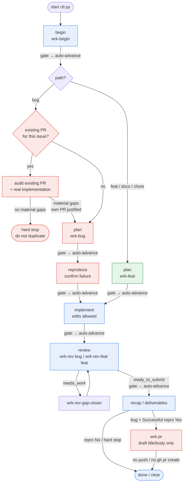

# WRK E2E

Run the full work pipeline **end-to-end with no human
in the loop**. Continuous is the **default**: after each `$CTL gate …`,
auto-advance and **immediately run the next phase in the same turn**.
Do not ask the user to type `continue`. Do not stop between phases.

Opt into pauses only if the user explicitly asks for HITL / `--hitl` /
`pause between phases`.

## Path (must follow)

Bug and feature share a trunk, diverge for plan/repro, then converge again.



**Convergence points:** `implement` ← both paths; `review` ← after implement; `recap` ← after READY review; `wrk-pr` ← after Successful repro Yes (draft only).

**Never skip:** begin → plan → (reproduce if bug) → implement → review → recap → (wrk-pr if repro Yes).

**Bug path — existing PR gate (required):** after classifying **bug**, before plan/repro/implement, check whether a PR already targets this issue. If yes, audit it (see below). Do not silently invent a parallel PR.

---

## Hard rules (entire run)

- **DO NOT push** anything to any remote.
- **DO NOT post comments** on GitHub (issues, PRs, reviews).
- **DO NOT open a PR** unless the user separately asks **after** this skill finishes.
- Local commits only if the user explicitly asks.
- Fork already exists — skip fork creation; sync fork + `upstream`, branch from
  the upstream **PR base** (template base or default — not necessarily `main`).
  **Hard gates (not optional):**
  - `ctl gate begin` — checkout must not be behind upstream (auto Sync fork /
    fetch+merge/rebase when possible). Prefer: `fetch upstream` → checkout
    `<base>` → sync → then create the work branch.
  - `ctl gate recap` — same behind=0 check after work (upstream may have moved).
  - `ctl check-pr-base` — required before `wrk-pr` / `wrk-push`.
  Conflicts → `STATUS: hard_stop` + recovery commands (no silent continue).
- Hooks enforce: no product edits until `implement`/`review`; no push/comment while active.
- Skill/command edits under `~/.cursor/skills`, `~/.cursor/commands`, `~/.claude/skills`, `~/.claude/commands` are allowlisted (meta edits OK).
- Use the current harness's native conversation-renaming capability when
  begin (issue number) or recap requests a rename.
- Never call `$CTL advance` in continuous mode — it will fail; use `$CTL gate <phase>` only.

## Bundled pipeline (on file in suite repo)

The full e2e chain ships in the **suite repo** checkout. Prefer these
paths; fall back to `$HOME` only if missing:

| Phase | Bundled path |
|-------|----------------|
| begin | `.cursor/skills/wrk-begin/SKILL.md` |
| plan (bug) | `.cursor/commands/wrk-bug.md` |
| plan (feat) | `.cursor/commands/wrk-feat.md` |
| review (bug) | `.cursor/commands/wrk-rev.md` |
| review (feat) | `.cursor/commands/wrk-rev-feat.md` |
| gap closer | `.cursor/skills/wrk-rev-gap-closer/SKILL.md` |
| PR draft | `.cursor/skills/wrk-pr/SKILL.md` |
| controller | `.cursor/skills/wrk-e2e/` |

Also bundled: `.cursor/commands/wrk-begin.md`, `wrk-rev-com.md`,
`wrk-rev-gap-closer.md`. Extra skills (not on the e2e path): `wrk-ci`,
`wrk-nit-picker`, `wrk-reviewer-ono`.

Resolve once per session:

```bash
WRK_ROOT="$(find . -path '*/.cursor/skills/wrk-e2e/scripts/ctl.py' 2>/dev/null | head -1 | xargs dirname | xargs dirname | xargs dirname | xargs dirname)"
# WRK_ROOT → suite checkout (or multi-repo nested checkout)
WRK_BEGIN="$WRK_ROOT/.cursor/skills/wrk-begin/SKILL.md"
WRK_BUG="$WRK_ROOT/.cursor/commands/wrk-bug.md"
WRK_FEAT="$WRK_ROOT/.cursor/commands/wrk-feat.md"
WRK_REV="$WRK_ROOT/.cursor/commands/wrk-rev.md"
WRK_REV_FEAT="$WRK_ROOT/.cursor/commands/wrk-rev-feat.md"
WRK_REV_GAP_CLOSER="$WRK_ROOT/.cursor/skills/wrk-rev-gap-closer/SKILL.md"
WRK_PR="$WRK_ROOT/.cursor/skills/wrk-pr/SKILL.md"
```

If a file is missing under `WRK_ROOT`, fall back to the same path under
`$HOME/.cursor/` (or `$HOME/.claude/commands/` for mirrors).

## Controller (required)

Resolve the skill root (**prefer repo-bundled**, then home install):

```bash
SKILL_ROOT="$(find . -path '*/.cursor/skills/wrk-e2e/scripts/ctl.py' 2>/dev/null | head -1 | xargs dirname | xargs dirname)"
if [ -z "$SKILL_ROOT" ] && [ -f "$HOME/.cursor/skills/wrk-e2e/scripts/ctl.py" ]; then
  SKILL_ROOT="$HOME/.cursor/skills/wrk-e2e"
fi
CTL="python3 $SKILL_ROOT/scripts/ctl.py"
```

**Per-conversation isolation:** pass the current conversation id (or any stable id) so concurrent chats do not share phase state:

```bash
export WRK_E2E_RUN_ID="${WRK_E2E_RUN_ID:-<conversation_id>}"   # preferred for the whole run
$CTL start --issue URL --run-id "$WRK_E2E_RUN_ID"
# later gates inherit WRK_E2E_RUN_ID, or pass --run-id explicitly
```

State lives at `~/.cursor/wrk-e2e/runs/<run_id>.json` (legacy mirror: `state.json`).
Every `ctl` transition and every hook **deny** appends to `~/.cursor/wrk-e2e/audit.jsonl`.

---

## Remote run

When this run is remote:

- Pipeline skills load from the attached **suite repo** checkout
  (`.cursor/skills/wrk-{e2e,begin,pr}/`, `.cursor/commands/wrk-{bug,feat,rev,rev-feat}.md`),
  not only `$HOME`.
- Always set `WRK_E2E_RUN_ID` from the env var for this run.
- Provider wallet checks use injected `envVars` (e.g. `OPENROUTER_API_KEY`,
  `ANTHROPIC_API_KEY`, `NOUS_API_KEY`). OpenRouter/Nous use balance APIs;
  Anthropic uses a minimal Messages probe (no public USD balance endpoint).
  1Password is **not** available on the remote VM. If
  `$CTL check-provider-wallet` returns `top-up` or `unknown`, hard-stop.
- Path is **bug** only by default (non-extension remote);
  continuous; **reproduce-or-stop**.
- **Extension bypass (only):** when the run was started with
  `$CTL start … --launch-source extension` (or
  `$CTL set-launch-source --source extension`), remote may take
  `$CTL set-path feat` and the feature path (skip reproduce → implement).
  No other launch source unlocks remote + feat.
- **Extension + feat — soft labels are not hard stops:** labels like
  `needs-decision`, `needs-design`, `awaiting-decision`, `rfc`, or issue
  text that says “awaiting maintainer decision” are **not** ctl gates and
  **must not** become `STATUS: hard_stop` on this path. Pick a concrete
  default that fits the repo, implement a **scoped first milestone** from
  the issue, and document the choice in the final report / PR draft.
  Hard-stop only for real blockers (missing required credentials when
  named, wallet top-up/unknown, unreproducible *bug* path, true duplicate
  with no material gaps, wrong base, or similar ctl/env hard stops).
- **Do not** open a PR (`gh pr create`). **Do not** post issue/PR comments.
- **DO NOT `git push`** — not to origin, not to the fork, not `--force-with-lease`,
  nothing. Same as local wrk-e2e. Finding “no existing PR” is **not** permission
  to push. remote mode does **not** override the Hard rules above.
- **Never** put `Fixes` / `Closes` / `Resolves` + `#<n>` (or `#<n>` / the issue
  URL) in **commit messages** if you commit locally — GitHub auto-links those
  onto the upstream issue timeline if the SHA ever becomes reachable. Issue
  linkage belongs only in the **PR body draft** (wrk-pr).
- After a successful bug run (Successful repro **Yes**), run **wrk-pr** to draft
  title/body into the final report — still no PR open.
- Final reply **must** begin with one of:
  `STATUS: ready` | `STATUS: repro_failed` | `STATUS: hard_stop` | `STATUS: error`

| Command | Purpose |
|---------|---------|
| `$CTL start --issue URL [--path bug\|feat] [--launch-source …] [--run-id ID]` | Start run at `begin` (**continuous** by default) |
| `$CTL start --issue URL --hitl` | HITL mode: pause after each gate for user `continue` |
| `$CTL set-path bug\|feat` | Set classification (remote + feat needs launch_source=extension) |
| `$CTL set-launch-source --source extension\|local\|other` | Who started the run (required before gate begin) |
| `$CTL set-provider --none \| --provider NAME …` | Record provider involvement |
| `$CTL check-provider-wallet` | Live wallet check (Provider: Yes; top-up/unknown hard-stops) |
| `$CTL status [--run-id ID]` | Show this run's state |
| `$CTL list` | List all per-run state files |
| `$CTL gate <phase> [--pillar N=V …] [--provenance TIER] [--run-id ID]` | Mark phase complete → **auto-advance** to next (continuous) |
| `$CTL score <phase> --pillar N=V … [--run-id ID]` | Emit pillar scores without advancing (use for `pr` after recap) |
| `$CTL advance` | HITL only — after user says continue (**rejected in continuous**) |
| `$CTL record-review --file review.json` | Record validated wrk-rev artifact (required before `gate review`) |
| `$CTL record-closer --file closer.json` | Record validated gap-closer artifact |
| `$CTL clear [--run-id ID]` | End/clear the run |

### Pillar verdicts at each gate

On each `$CTL gate <phase>`, also record that phase's **pillar** verdicts with
repeatable `--pillar NAME=VALUE` (dtype is looked up automatically; unknown
names are ignored, never blocking the gate). Objectively-derivable pillars
(`reproduce.*` from state, `implement.scope-discipline`/`test-coverage` from the
git diff) are computed by the controller — you may omit them. Pass the
qualitative ones with `--provenance self`. This is best-effort telemetry and
must never delay a gate. Per-phase pillars:

- **plan** (`--provenance self`): `approach-soundness`, `environment-fit`,
  `assumption-surfacing`, `reuse-awareness`, `falsifiability` (0–1 or true/false)
- **reproduce**: controller derives `surface-fidelity`, `environment-fidelity`,
  `credential-integrity`, `failure-match` — override `failure-match=0` if what
  broke wasn't the reported failure; add `control-validity=1` if you ran a
  negative control.
- **implement**: controller derives `scope-discipline`, `test-coverage`; you add
  `correctness=<pass ratio>`, `regression-safety=<0|1>`, `convention-fit=<0|1>`
  with `--provenance derived:ci` when from a test/lint run.
- **review** (`--provenance wrk-rev` on the bug path, `--provenance wrk-rev-feat` on the feat path): `requirement-coverage`,
  `guideline-compliance` (0–1), `readiness-verdict=ready|needs-work`,
  `self-catch-rate=<count of issues you caught>`.
- **pr** (after recap, `--provenance wrk-pr`, via `$CTL score pr`):
  `template-adherence` (0–1), `claim-accuracy`, `evidence`, `format-compliance`.

### Continuous mode (default)

After every `$CTL gate …`, the controller prints
`PHASE <name> COMPLETE — continuous advance → <next>` and sets `phase` to the next
step. **Immediately execute that next phase in the same turn.** Keep going until
recap is gated (or a hard stop: unreproducible bug, blocked triage, existing
PR already covers the issue with no material gaps, etc.).
On any terminal end (recap **or** hard stop), rename this Cursor chat to the
issue number — see Phase: recap step 4.

### HITL mode (opt-in only)

Only when started with `--hitl` (or user asked to pause): after `$CTL gate …`,
stop and print `PHASE <name> COMPLETE — reply continue to proceed.` Wait for
continue, then `$CTL advance`.

---

## Phase: begin

0. **Rename this conversation first — before `$CTL start` or `$WRK_BEGIN`.**
   Extract the issue number from the `--issue` URL / `$ARGUMENTS` / `#N` /
   bare digits. Title is **digits only** (no `#`, no repo, no issue title).
   Example: `https://github.com/org/repo/issues/904320` → `904320`.
   Use the harness rename capability (`rename_chat`) on **this same**
   conversation. If the title is already that issue number, skip. If it is
   already `{issue}/{pr}`, do not smash it back. If no number is available:
   ask once, rename, then continue. Do not start ctl or triage until renamed.
1. `$CTL start --issue <url>` (add `--path` if known; add `--hitl` only if user asked).
2. **Read and follow completely:** `$WRK_BEGIN`
   (bundled `.cursor/skills/wrk-begin/SKILL.md` in the suite checkout; else `~/.cursor/skills/wrk-begin/SKILL.md`).
3. Classify **bug** vs **feat**. If unset: `$CTL set-path bug|feat`.
4. Surface the full wrk-begin answers.
5. **If path is bug — existing-PR check (before gating begin):** run
   [Bug path: existing PR already submitted](#bug-path-existing-pr-already-submitted).
   If that check hard-stops, skip plan/implement; go to recap (include the
   audit + “no own PR” justification), then `$CTL clear` / rename chat.
6. **Provider + credentials (hard gates):** From begin step 10:
   - Provider: `$CTL set-provider --none` **or**
     `$CTL set-provider --provider NAME […]` (names from issue/labels/docs —
     not a canned provider menu).
   - **If Provider: Yes:** `$CTL check-provider-wallet` (live credits).
     `top-up` / `unknown` → **hard-stop** (not repro_failed). Cloud uses
     injected envVars only — no 1Password on the VM.
   - Credentials: `$CTL set-required-env --none` **or**
     `$CTL set-required-env --require ENV_NAME […]` (names from issue/repo —
     not a provider menu). If Special app is Discord and credentials are Yes,
     add `--external-app discord` (and require Discord env).
   Then `$CTL gate begin` → **continue immediately into plan**.
   `gate begin` fails if provider/wallet/credential records were skipped or
   wallets are not all funded.
7. **Work host (hard gate):** From begin step 16, run
   `$CTL set-work-host --remote yes` **or**
   `$CTL set-work-host --remote no --local yes|no --mac yes|no [--cwd PATH]`.
   Local Mac work may run from **any** directory. `gate begin` fails only if this was skipped.
7b. **Launch source (hard gate):** Record who started the run:
   `$CTL set-launch-source --source extension|local|other`
   (or pass `--launch-source` on `$CTL start`). `gate begin` fails if skipped.
   **`extension` is the only source that allows remote + `set-path feat`.**
   Local/other remote stays bug-only. The browser/desktop extension
   must set `--source extension` at start — agents must not invent it.
8. **Grok Bot desktop playbook (hard gate):** From begin step 13, run
   `$CTL set-grok-desktop --grok-bot yes|no --bug yes|no --desktop yes|no --interface-ops yes|no [--interface-ops-why "…"]`.
   `gate begin` fails if this was skipped. Do **not** run the playbook in begin.
   The playbook is used only in reproduce, and only if `playbook_required`
   (interface-ops + bug + Grok Bot) — not Desktop or Bot alone.
9. **Cursor Desktop computer-use (hard gate):** From begin step 15, run
   `$CTL set-cursor-desktop-cu --desktop yes|no --windows yes|no --local-cursor yes|no --interface-ops yes|no [--interface-ops-why "…"]`.
   `gate begin` fails if this was skipped. Do **not** run computer-use in begin.
   When `cu_required` (interface-ops + Windows no + local Cursor yes), reproduce
   and/or implement **must** follow
   the live desktop app — **no freestyle**.
   Applies to bugs and features. Desktop alone does not turn CU on.

---

## Bug path: existing PR already submitted

**When:** path is **bug**, immediately after classification (still in begin /
before plan). Also re-check at the start of implement in case a PR landed
mid-run.

**Find candidates** (do all that apply; do not stop at the first miss):

- `gh issue view <n> --json closedByPullRequestsReferences,timelineItems` /
  linked PRs in the issue UI
- `gh pr list --search "<n> in:title,body" --state all` (and `Fixes #<n>` /
  `Closes #<n>` / issue URL in PR bodies)
- Crwrk-refs already listed in wrk-begin step 6

If **no** PR targets this issue → say so explicitly and continue the normal
bug path **locally** (plan → reproduce → implement → review → recap).
That finding is **not** a reason to `git push`, open a PR, or comment on
GitHub. Work stays on the machine until the user asks otherwise.

If **one or more** PRs target this issue → **do not implement yet.** For
**each** open (and each recently merged) PR:

1. **Go over the PR** — title, body, linked issue claims, review comments,
   CI status, draft vs ready, whether it says it fixes this issue.
2. **Go over the actual implementation** — read the real diff
   (`gh pr diff` / checkout locally if needed), not just the PR description.
   Trace how the patch touches the failure surface from triage/repro.
3. **Identify gaps that actually matter for this issue** — only material
   gaps: wrong/missing fix for the reported symptom, incomplete sibling call
   paths, broken invariants (cache, alternation, security), missing tests the
   repo expects for this class of bug, or a fix that fights stated design
   intent. Ignore cosmetic nits, style prefs, and “nice to have” refactors
   that do not change whether the issue is solved.
4. **Justify submitting our own PR (or not)** — pick exactly one and argue
   from evidence:
   - **Own PR justified** — list the material gaps the existing PR leaves;
     our work must target those gaps (or a clearly better complete fix), not
     duplicate the same patch.
   - **Own PR not justified** — existing PR already covers the issue (or
     remaining gaps are immaterial). **Hard stop:** do not implement a
     parallel fix; recap with the audit and tell the user to review/help the
     existing PR instead.

Surface the full audit (PR URLs, gap list, own-PR justification) in the
begin/plan output **and** again in the final recap (required item below).

---

## Phase: plan

1. Confirm phase is `plan` (`$CTL status` if needed). In continuous mode, gate already advanced.
2. **Bug:** follow `$WRK_BUG` (bundled `.cursor/commands/wrk-bug.md`) — plan only, do not fix.
   If an existing-PR audit already ran and **own PR is justified**, the repro /
   fix plan must focus on the **material gaps** found — not a from-scratch
   reimplementation of what the other PR already does correctly.  
   **Feat:** follow `$WRK_FEAT` (bundled `.cursor/commands/wrk-feat.md`) — plan only, do not implement.
3. Surface the full plan answers.
4. `$CTL gate plan` → **continue immediately** (bug → reproduce; feat → implement).

---

## Phase: reproduce (bug only)

1. Confirm phase is `reproduce`.
2. Execute the wrk-bug repro plan. Confirm failure with evidence.
   **Cheapest faithful surface first:** reproduce on the cheapest surface that truly
   exercises the cited failure path before any expensive one (GCP Windows VM, desktop
   GUI, remote host). A surface that wrk-begin marked **intrinsic** stays required — the
   cheap path does not substitute for it. For **incidental/ambiguous** surfaces the cheap
   surface is a faithful repro; escalate only on its demonstrated failure. The GCP
   Windows host is gated: `$CTL attest-windows-surface --reason intrinsic|cheap-repro-failed --evidence "…"`.
3. **Credentials:** `$CTL gate reproduce` fails if begin recorded `--require`
   env names that are missing/empty. Live-use those vars; do not mock past them.
   **No-mock-HTTP gate (hard-enforced by ctl, when required env recorded / API = Yes):**
   the repro **must** hit the real API over a live HTTP layer using the named
   credential. Mocking/stubbing/faking/intercepting or record-replaying the HTTP
   layer or its routes is **forbidden** — no `responses`/`requests-mock`/
   `httpretty`/`nock`/`msw`/`vcr`/cassettes, no monkeypatched client/transport,
   no fixture server standing in for the real endpoint. After the live call, run
   `$CTL attest-live-http --evidence "…real request (method+endpoint/client call)
   + status/response outcome, no secrets…"`. **`$CTL gate reproduce` hard-fails**
   without this attestation, and the attestation itself is **rejected** if the
   evidence names a mock/stub/cassette. (Discord runs use `attest-live-use`
   instead — it already proves live use.) If you cannot make the real call,
   hard-stop on missing env; a mock-based repro does **not** count as reproduced.
4. **Discord Yes:** If begin recorded `--external-app discord` / Discord
   required env, perform the live Discord actions the issue needs, then
   `$CTL attest-live-use --app discord --evidence "…"` before gating.
   `gate reproduce` fails without that attestation.
5. **Desktop CU (only if `playbook_required`):** If `set-grok-desktop` recorded `playbook_required: YES`, drive the live desktop app, then `$CTL attest-mac-playbook --evidence "…"`. `gate reproduce` fails without that attestation.
6. **Desktop CU (when `cu_required`):** If `set-cursor-desktop-cu` recorded `cu_required: YES`, drive the live desktop app. **No freestyle.** Then `$CTL attest-cursor-desktop-cu --evidence "…"`. `gate reproduce` fails without that attestation.
7. **Do not patch** until confirmed. If unreproducible, stop and report.
8. `$CTL gate reproduce` → **continue immediately into implement**.

---

## Phase: implement

1. Confirm phase is `implement` (hooks now allow product edits).
2. **Bug:** re-check for an existing PR (same search as the begin gate). If a
   new PR appeared and leaves **no** material gaps → hard stop (do not
   duplicate). If own PR was already justified, implement only the gap-closing
   fix after confirmed repro — do not re-copy the other PR’s correct parts.
   **Feat:** implement per plan. `$CTL gate implement` fails if recorded
   credential env names are missing/empty.
3. **Cursor Desktop CU (when `cu_required`):** If begin recorded `cu_required: YES`
   and attestation is not yet on the run (feature path skips reproduce), follow
   the live desktop app
   and `$CTL attest-cursor-desktop-cu --evidence "…"` before gating. **No freestyle.**
   `gate implement` fails without that attestation when required.
4. Follow CONTRIBUTING / tests. Still no push, no GitHub comments.
   **No-mock-HTTP gate (hard-enforced by ctl, when required env recorded / API = Yes):**
   any live verification of the fix (bug) or live validation of the feature (feat)
   **must** hit the real API over a live HTTP layer using the named credential —
   never a mocked/stubbed/intercepted/replayed HTTP layer or routes (`responses`,
   `requests-mock`, `httpretty`, `nock`, `msw`, `vcr`/cassettes, monkeypatched
   transports, fixture servers). Repo-shipped unit tests that mock HTTP are fine as
   the project's own suite, but they do **not** substitute for the live-call
   evidence. On the feat path (which skips reproduce) the live call is attested
   here: run `$CTL attest-live-http --evidence "…"`; **`$CTL gate implement`
   hard-fails** without it when API = Yes (the bug path already attested at
   reproduce, which carries forward). Evidence naming a mock/cassette is rejected.
4. `$CTL gate implement` → **continue immediately into review**.

---

## Phase: review

1. Confirm phase is `review`.
2. **Pick the reviewer by path** (`state.path` from `set-path`):
   - **feat** → **Read and follow completely:** `$WRK_REV_FEAT`
     (bundled `.cursor/commands/wrk-rev-feat.md` in the suite checkout; else `~/.cursor/commands/wrk-rev-feat.md`).
   - **bug** → **Read and follow completely:** `$WRK_REV`
     (bundled `.cursor/commands/wrk-rev.md` in the suite checkout; else `~/.cursor/commands/wrk-rev.md`).

   The chosen reviewer must write `review.json`, pass `review_gate.py validate-review`,
   and `$CTL record-review --file review.json`. (Both reviewers emit the same
   `review.json` schema and use the same gap-closer; only the review content differs
   — feat adds the A4 approach gate.)
3. If recorded verdict is `needs_work`: **Read and follow completely:** `$WRK_REV_GAP_CLOSER`
   (same issue/PR args). Closer must close **all** open issue requirements
   (decide defaults, implement, run live). Cap: 4 closer cycles (`MAX_CLOSER_CYCLES`).
   Only missing required secrets (`blocked_env`) may remain open. Do not gate yet.
   After closer, wrk-rev runs again and re-records review.
4. When recorded verdict is `ready_to_submit`: `$CTL gate review`
   (fails without a valid recorded review) → **continue immediately into recap**.
   If still `needs_work` after max closer cycles, stop in review and report leftovers
   (do not force READY).

---

## Phase: recap

1. Confirm phase is `recap`.
2. Present deliverables (no remote actions):

   1. **Issue** — URL, title, bug vs feat  
   2. **What we did** — triage → plan → implementation  
   3. **Branch / local state** — branch, commits?, remotes **not** updated  
   4. **Files changed** — path + one-line why  
   5. **Verification** — repro evidence or readiness checks; tests  
   6. **Review verdict** — READY / NEEDS WORK / NOT STARTED + caveats  
   7. **Explicit non-actions** — nothing pushed; no GitHub comments  
   8. **Suggested next steps for the user** (do not execute unless asked)  
   9. **If bug** — Successful repro (required):
      - `- [x] Yes` or `- [ ] No` (exactly one checked)
      - Then a short explanation of what was (or was not) reproduced and the evidence.
   10. **Provider + credentials** — Provider related? Yes/No; if Yes, which
       name(s). API key needed? Yes/No; if Yes, env **names** + was key used?
       Yes/No + evidence (no secrets). Specific model needed? Yes/No; if Yes,
       model id + was it used? Yes/No + evidence.
   11. **If bug** — Existing PR audit (required; say “none found” if none):
      - PR URL(s) reviewed (or `none`)
      - Material gaps vs this issue (or `none — existing PR covers it`)
      - **Own PR justified?** `- [x] Yes` / `- [x] No` (exactly one) + short
        evidence-based justification (why our PR is needed, or why we stopped
        instead of duplicating)

3. `$CTL gate recap`. Optionally `$CTL clear`.

4. **Rename this conversation** to the original issue number only
   (digits, no `#`, no repo name, no title). Example: issue
   `https://github.com/org/repo/issues/904320` → chat title `904320`.
   Use the current harness's conversation-renaming capability on **this same**
   conversation. Do this at the end of every run that had an issue URL —
   including hard stops (unreproducible, blocked triage) after the final
   status report.

5. **If bug and Successful repro is `- [x] Yes`** — immediately run **wrk-pr**:
   - Read and follow `$WRK_PR` (bundled `.cursor/skills/wrk-pr/SKILL.md`).
   - **Before drafting:** wrk-pr’s sync step — fetch upstream PR base and rebase
     so `behind=0` (avoid opening a PR that’s N commits behind `main`/`dev`).
     Pushing the updated `cursor/...` branch to the **fork** is OK when rebase
     rewrites history. **Do not** open a GitHub PR.
   - Draft PR title + body only after sync. Include title, body, and
     `base=… behind=0 ahead=…` in the final report (under the `STATUS:` line).
   - If Successful repro is No, or the run hard-stopped / unreproducible: **skip**
     wrk-pr.

Stop here.
